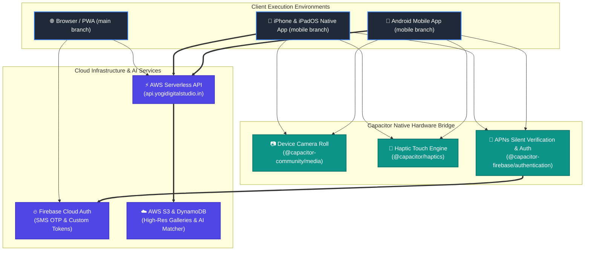

# 📸 Yogi Digital Studio — Frontend & Cross-Platform Suite

A state-of-the-art, AI-powered digital photo studio client platform built for professional photography studios and their VIP clients to seamlessly explore, download, and curate high-resolution memories across Web, iOS, and Android devices.

 

 

---

## 📲 Download & Access the Application

| Platform | Download / Application URL | Status | Supported Repository Branch |
| :--- | :--- | :--- | :--- |
| **Google Play Store (Android)** | <!-- REPLACE_WITH_YOUR_PLAYSTORE_LINK_HERE --> *(Coming Soon)* | Under Review / Available | `mobile` (Capacitor Android) |
| **Apple App Store (iOS & iPadOS)** | [Download on App Store](https://apps.apple.com/in/app/yogi-digital-studio/id6790760209) | Live 🚀 | `mobile` (Capacitor iOS) |
| **Live Web Studio & PWA** | [https://yogidigitalstudio.in](https://yogidigitalstudio.in) | Live 🚀 | `main` (Standard Web) |

*(Note: Replace the placeholders above with your official App Store and Play Store direct install URLs once live!)*

---

## 🏗️ System Architecture & Cross-Platform Execution

The platform is designed around a unified React core that compiles seamlessly into progressive browser experiences and hardware-accelerated mobile binaries using **Capacitor**.

---

## 🔄 Client Portal Gallery Workflow

Here is how customers interact with the platform—from instant passwordless SMS login to preserving memories directly on their device:

```mermaid
sequenceDiagram
    autonumber
    actor Client as 👤 Studio Client
    participant App as 📱 Mobile / Web Client
    participant FB as 🔥 Firebase Authentication
    participant API as ⚡ AWS Serverless Backend
    participant Dev as 🖼️ Native Device Library

    Client->>App: Enter Registered Phone Number
    App->>FB: Request Passwordless SMS OTP (APNs verified on native)
    FB-->>Client: Receive Instant 6-Digit Code
    Client->>App: Verify OTP Token
    App->>API: Authenticate & Fetch Assigned Studio Events
    API-->>App: Return Gallery Trees, Folders, & High-Res Thumbnails
    
    rect rgb(20, 20, 40)
        Note right of Client: 🎨 Interactive Gallery Exploration
        Client->>App: Open Dynamic Lightbox / AI Face Match Filter
        App->>App: Render Framer Motion Zoom & Swipes + Haptic Feedback
    end
    
    Client->>App: Click "Save All Memories" / Download Photo
    App->>Dev: Write Original Resolution Media Straight to Camera Roll!
    Dev-->>Client: ✅ High-Res Memories Saved Automatically
```

---

## 🌟 Comprehensive Feature Suite

### 👤 VIP Client Portal & Customer Experience
- **Frictionless SMS Login:** Fast, secure phone verification powered by Firebase Authentication without passwords.
- **AI Face Match & Local Privacy:** Built-in biometric disclosure frameworks designed to filter galleries for photos containing the client without transmitting or reselling personal identity metrics to third-parties.
- **Fluid Lightbox Navigation:** Smooth zooming, swiping, and browsing engineered with Framer Motion and rich modern HSL dark themes.
- **Native Media Preservation:** Download a single showcase photo or batch-export complete event archives natively directly into iPhone, iPad, and Android photo albums.
- **Apple Compliant Self-Serve Privacy:** Complete account deletion tools integrated straight into the customer profile dashboard—compliant with **App Store Guideline 5.1.1(v)** to destroy personal authentication records instantly upon request.

### 🛠️ Photographer Command Center (Admin Suite)
- **Studio Dashboard & Analytics:** Complete overview of published events, registered studio VIPs, and storage performance.
- **Deep Folder Structure Curations:** Organize weddings, commercial shoots, and portraits into nested subfolders with bespoke cover selections.
- **AI Photo Model Manager:** Direct interface to generate and inspect generative models trained on custom promotional assets.
- **Event Access Controls:** Easily assign confidential event passcodes and grant explicit access permissions to individual client phone numbers.

---

## 🔀 Multi-Branch Architecture

This repository adopts a specialized branching paradigm to serve both web and compiled mobile app binaries cleanly:
* **`main` Branch (Core Web & PWA):** Serves lightweight bundles optimized for desktop photographers and web browsers.
* **`mobile` Branch (Native App Ecosystem):** Contains embedded Xcode (`ios/`) and Android Studio (`android/`) working workspaces, native iOS APNs silent push fallback interceptors, and iPad multitasking layout capabilities.

---

## 📄 Ownership & Confidentiality
All digital designs, UI/UX workflows, source architecture, and photography assets are exclusive and proprietary intellectual property of **Yogi Digital Studio**.
